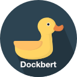

# Dockbert

> A simple [Traefik][traefik] Setup.

## Table of Content

* [Requirement](#requirement)
* [Configuration](#configuration)
* [Setup](#setup)
* [Start and Stop](#start-and-stop)
* [Basic Auth User](#basic-auth-user)
* [Let's Encrypt](#lets-encrypt)
* [Copyright](#copyright)
* [License](#license)


## Requirement

* A linux server (e.g Debian or Ubunutu)
* [Docker CE][docker] installed in the server
* User are able to run docker commands
* The Apache utils and program `htpasswd` for generates the basic auth


## Configuration

The docker compose files is required some environment variables for start the Traefik service.

* `DOCKBERT_DOMAIN` The domain for the dashboard
* `DOCKBERT_CONTAINER_NAME` The container name. This is optional, default `dockbert-traefik`.
* `DOCKBERT_USERS_FILE` The file with the user authorization (see section [Basic Auth User](#basic-auth-user))
* `DOCKBERT_ACME_EMAIL` The email address for [Let's Encrypt][letsencrypt]
* `DOCKBERT_ACME_PATH` The directory where saving the [Let's Encrypt][letsencrypt] the data

> The environment variables are setting in different kind:
>
> * Add a file `dockbert.env` in the user home directory
> * Set the environment variables in the bash or other initial RC files


## Setup

* Create network **dockbert-net**. `docker network create dockbert-net`
* Define the Environment variables
* Add bash script `dockbert` to the **PATH** for simplify start and stop the **dockbert traefik**


## Start and Stop

The bash script `dockbert` is help to start and / or stop the **dockbert traefik**

**Show the help / usage**

```shell
$ dockbert help
```

**Start the service**

```shell
$ dockbert start
```

**Stop the service**

```shell
$ dockbert stop
```


## Basic Auth User

The user file `${HOME}/etc/users.passwd`.

```shell
$ htpasswd -cb ./etc/users.passwd sarah password
```


## Let's Encrypt

The directory `${HOME}/etc/traefik/acme` contains the acme.json file

```shell
$ mkdir -p etc/traefik/acme
```

## Copyright

* Docker & Docker Compose: <https://www.docker.com/>
* Traefik: <https://doc.traefik.io/traefik/>
* Logo: <a href="https://www.flaticon.com/free-icons/duck" title="duck icons">Duck icons created by Pixel perfect - Flaticon</a>

## License

```text
Copyright 2022 Blueskyfish

Permission is hereby granted, free of charge, to any person obtaining a copy
of this software and associated documentation files (the "Software"), to deal
in the Software without restriction, including without limitation the rights
to use, copy, modify, merge, publish, distribute, sublicense, and/or sell
copies of the Software, and to permit persons to whom the Software is
furnished to do so, subject to the following conditions:

The above copyright notice and this permission notice shall be included in
all copies or substantial portions of the Software.

THE SOFTWARE IS PROVIDED "AS IS", WITHOUT WARRANTY OF ANY KIND, EXPRESS OR
IMPLIED, INCLUDING BUT NOT LIMITED TO THE WARRANTIES OF MERCHANTABILITY,
FITNESS FOR A PARTICULAR PURPOSE AND NONINFRINGEMENT. IN NO EVENT SHALL THE
AUTHORS OR COPYRIGHT HOLDERS BE LIABLE FOR ANY CLAIM, DAMAGES OR OTHER
LIABILITY, WHETHER IN AN ACTION OF CONTRACT, TORT OR OTHERWISE, ARISING FROM,
OUT OF OR IN CONNECTION WITH THE SOFTWARE OR THE USE OR OTHER DEALINGS IN THE
SOFTWARE.
```

[docker]: https://www.docker.com/
[traefik]: https://doc.traefik.io/traefik/
[letsencrypt]: https://letsencrypt.org/